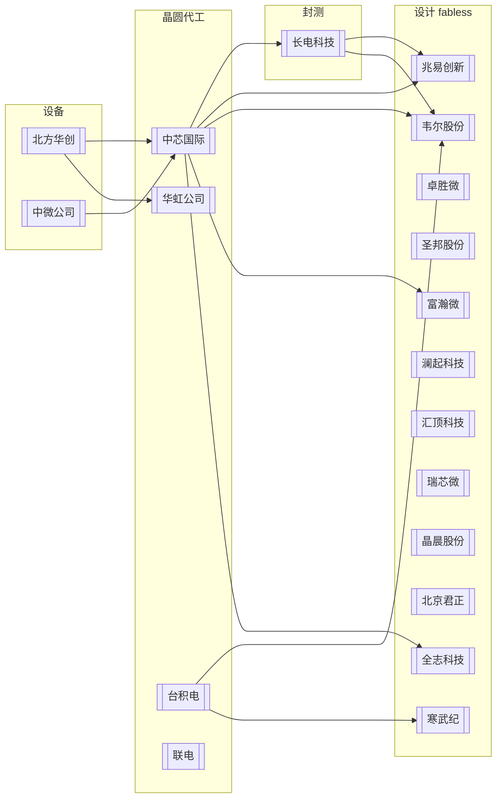

# 半导体产业链全景（15 家龙头）

覆盖设计（fabless）/ 代工 / 设备 / 封测四大环节。

## 环节与代表公司

| 环节 | 公司 | 一句话 |
|------|------|--------|
| 设备 | [[北方华创]] | 国内半导体设备龙头（刻蚀/薄膜/清洗/炉管） |
| 设备 | [[中微公司]] | 刻蚀设备 + MOCVD 龙头 |
| 代工 | [[中芯国际]] | 大陆技术最先进、规模最大晶圆代工 |
| 代工 | [[华虹公司]] | 特色工艺代工龙头（嵌入式存储/功率/模拟） |
| 封测 | [[长电科技]] | 全球封测龙头（OSAT） |
| 设计-存储/MCU | [[兆易创新]] | NOR Flash + MCU |
| 设计-CIS | [[韦尔股份]] | 全球 CMOS 图像传感器头部 |
| 设计-射频 | [[卓胜微]] | 射频前端（滤波器/开关/LNA） |
| 设计-模拟 | [[圣邦股份]] | 信号链 + 电源管理模拟龙头 |
| 设计-AI | [[寒武纪]] | 云端/边缘 AI 芯片 |
| 设计-接口 | [[澜起科技]] | 内存接口芯片全球双寡头之一 |
| 设计-传感 | [[汇顶科技]] | 指纹/触控芯片龙头 |
| 设计-SoC | [[瑞芯微]] | AIoT 应用处理器 |
| 设计-SoC | [[晶晨股份]] | 机顶盒/电视 SoC |
| 设计-嵌入式 | [[北京君正]] | 嵌入式 CPU + 车规存储 |
| 设计-视觉 | [[富瀚微]] | 安防视觉芯片 |
| 设计-AIoT | [[全志科技]] | 智能应用处理器 |

## 关键关系

- **代工依赖**：兆易创新（NOR Flash）、韦尔股份（CIS）、富瀚微、全志科技 → [[中芯国际]]；韦尔股份/寒武纪 → [[台积电]]
- **设备采购**：[[中芯国际]]、[[华虹公司]] → [[北方华创]]、[[中微公司]]
- **封测**：[[长电科技]] 服务国内主流设计公司；[[中芯国际]] 2017 年 26 亿入股成其第一大股东（历史）（信息年份: 2017）
- **大基金持股**：[[国家集成电路产业投资基金]] → [[中芯国际]]（4.17%）、[[北方华创]]（4.1%）、[[长电科技]]（2%）、[[华虹公司]]（二期 2.78%）

## 关联

- [[安防芯片产业链]] · [[端侧AI芯片竞争格局]] · [[中芯国际]] · [[北方华创]] · [[兆易创新]]
