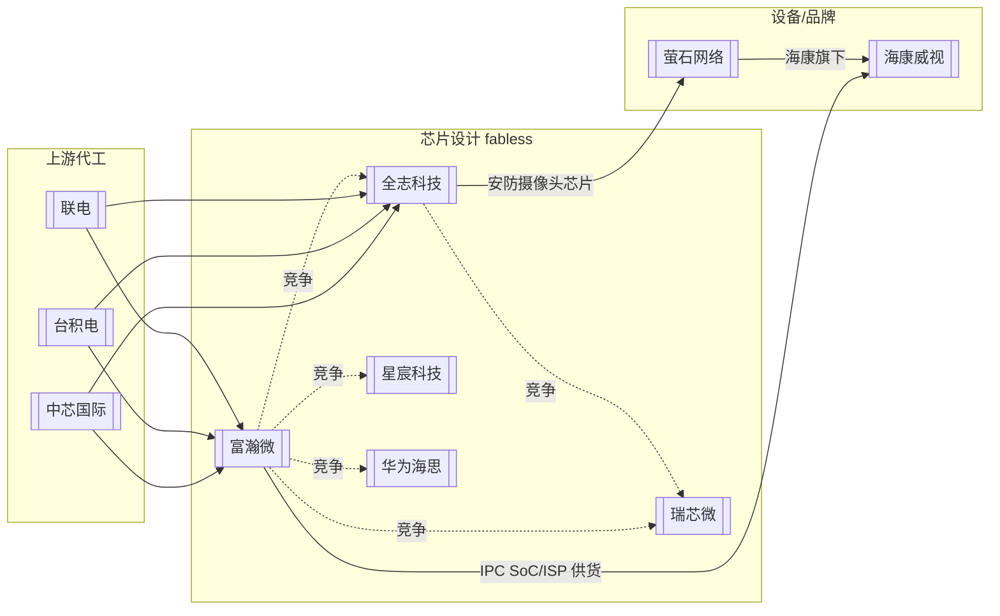

# 安防芯片产业链

## 关键观察

1. **供应链重叠**：[[富瀚微]] 与 [[全志科技]] 同为 fabless，晶圆代工都依赖 [[中芯国际]]/[[台积电]]/[[联电]]——上游集中度风险相同。
2. **海康生态双入口**：富瀚微直供海康本部 IPC 芯片；全志供货海康旗下[[萤石网络]]安防摄像头芯片。两家都在海康生态里有位置，形成**间接竞争**。
3. **芯片设计环节竞争密集**：端侧 AI/视频芯片赛道玩家包括富瀚微、全志、瑞芯微、星宸、海思（来源：[物联网世界 2025-07-25](https://www.iotworld.com.cn/html/News/202507/08f134908e69d12a.shtml)）。

## 关联

- [[富瀚微]] · [[全志科技]] · [[海康威视]] · [[萤石网络]] · [[端侧AI芯片竞争格局]]
