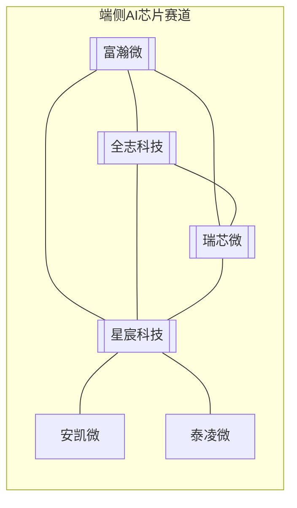

# 端侧AI芯片竞争格局

**直接竞争证据：物联网世界 2025-07-25 文章《端侧AI芯片争霸赛！瑞芯微、全志科技、星宸科技、富瀚微等多位玩家加速竞逐》**（[原文](https://www.iotworld.com.cn/html/News/202507/08f134908e69d12a.shtml)）

## 各家定位（2025 年报道口径）

| 公司 | 侧重 | 备注 |
|------|------|------|
| [[富瀚微]] | 视觉/视频芯片（安防+车载） | 安防芯片仅次于海思 |
| [[全志科技]] | 智能应用处理器 SoC（消费+车载+工业） | 智能音箱芯片国内出货占比 50%+ |
| [[瑞芯微]] | AIoT SoC，0.2-6 TOPS 算力 | 2024 营收增速 45%-47% |
| 星宸科技 | 安防 IPC SoC（原晨星系） | 与富瀚微直接竞品 |
| 华为海思 | 安防/视觉芯片（供应受限） | 空出的份额是争夺焦点 |

## 竞争关系结论（demo 口径）

- **直接竞争**：富瀚微 vs 全志科技，同在端侧 AI 视频/视觉芯片赛道（物联网世界点名）
- **间接竞争**：海康生态双入口（富瀚微→海康本部；全志→海康系萤石）
- **供应链重叠**：晶圆代工同为中芯/台积电/联电

## 关联

- [[富瀚微]] · [[全志科技]] · [[瑞芯微]] · [[安防芯片产业链]]
